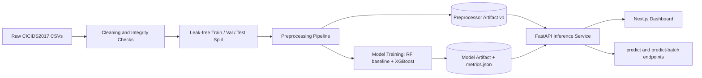

# AI-Driven Network Threat & Intrusion Detection System

This project demonstrates applied machine learning on an adversarial, real-world security
problem: production API design, rigorous evaluation methodology under class imbalance, and
engineering discipline (versioned artifacts, test-gated development) applied to a domain —
network security — that is unforgiving of sloppy evaluation.

A supervised ML pipeline that classifies network flow records (CICIDS2017, CICFlowMeter
features) as benign or one of several attack families, served through a FastAPI inference
service and visualized on a Next.js dashboard that **replays** flows from the held-out test
set. This is near-real-time inference on already-extracted flow records, not live packet
capture — see "Scope" below.

## Architecture



- `src/preprocessing/` — cleaning, leak-free splitting, feature engineering, the versioned
  preprocessor artifact.
- `src/models/` — RF baseline + XGBoost training, evaluation (full precision/recall/FPR/PR-AUC
  suite, not just accuracy), operating-threshold tuning, model card generation.
- `src/api/` — FastAPI service wrapping the trained model + preprocessor.
- `src/dashboard/` — Next.js app replaying held-out test flows through the live API.
- `docs/MODEL_CARD.md` — generated metrics report (regenerate with
  `python -m src.models.model_card`).

## Scope

This is a **detection** system (IDS), not prevention (IPS) — it classifies flows, it doesn't
block traffic. It operates on already-extracted flow records, not raw packets, and the
dashboard's "live" feed is a **replay** of held-out test data through the real inference API,
not a live network capture.

## Setup

**Python (3.12):**
```
python3.12 -m venv venv
venv/bin/pip install -r requirements.txt
```

**Dashboard (Node 20+):**
```
cd src/dashboard
npm install
```

## Running the pipeline

Each step writes a versioned artifact the next step reads — run in order on a machine with
`data/raw/*.csv` (CICIDS2017) present:

```
venv/bin/python -m src.preprocessing.clean          # data/interim/cleaned.parquet
venv/bin/python -m src.preprocessing.split           # data/processed/{train,val,test}.parquet
venv/bin/python -c "from src.preprocessing.pipeline import run; run()"  # NOT `-m` -- see note below
venv/bin/python -m src.models.train                  # trains RF + XGBoost, writes metrics.json
venv/bin/python -m src.models.leakage_check          # day-based leakage smell test + MODEL_CARD.md
venv/bin/python -m src.models.tune_threshold         # operating threshold (Pillar 4.3)
venv/bin/python -m src.models.compute_curves         # ROC/PR curve points for the dashboard
venv/bin/python -m scripts.build_replay_sample       # dashboard's replay fixture
```

**Note on `src.preprocessing.pipeline`:** always invoke it via `python -c "from
src.preprocessing.pipeline import run; run()"`, never `python -m
src.preprocessing.pipeline`. Running it as `__main__` binds the saved `Preprocessor`
class to the `__main__` module, producing a `preprocessor_v1.pkl` that fails to load
from any other process (the API included) — `Preprocessor.save()` now refuses to
write such an artifact and raises instead, so this fails loudly if it happens.

## Running the API + dashboard locally (no Docker)

```
venv/bin/uvicorn src.api.main:app --port 8000
# in another terminal
cd src/dashboard && API_BASE_URL=http://localhost:8000 npm run dev -- --port 3000
```
Dashboard: http://localhost:3000. API docs: http://localhost:8000/docs.

## Running the full stack (Docker Compose)

```
docker compose -f docker/docker-compose.yml up --build
```
Brings up `api` (port 8000) and `dashboard` (port 3000, talking to `api` over the compose
network). `artifacts/` is mounted read-only into the `api` container at runtime — it's real
trained-model output, gitignored, not baked into the image.

## Tests

```
venv/bin/pytest tests/unit/ -v                              # fast, no real dataset needed beyond fixtures
venv/bin/pytest tests/integration/test_api_endpoints.py -v   # needs a trained model (see pipeline above)
venv/bin/pytest tests/integration/test_pipeline_end_to_end.py -v -s   # boots the full stack; slow
```

## Reports

- `docs/MODEL_CARD.md` — full metrics (per-class precision/recall/F1/FPR, PR-AUC/ROC-AUC,
  confusion matrix), imbalance-handling rationale, day-based leakage smell test, known
  limitations.
